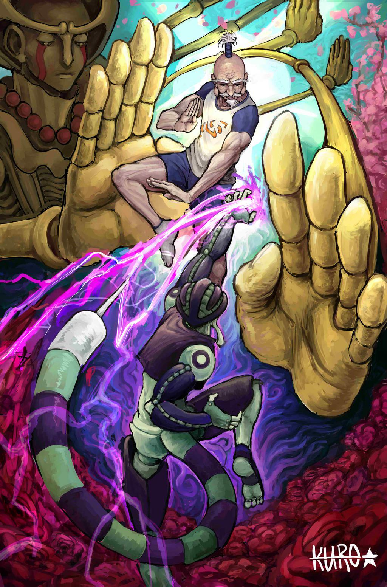
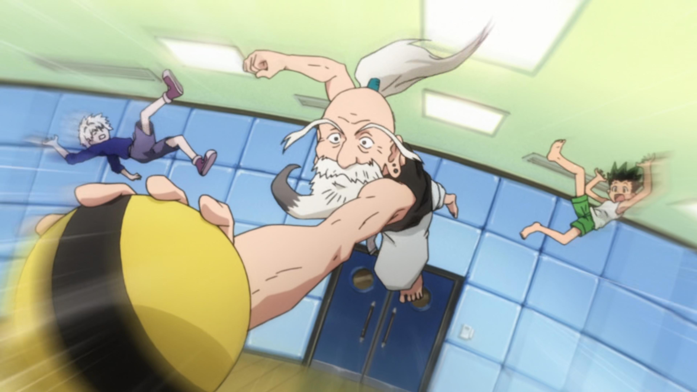
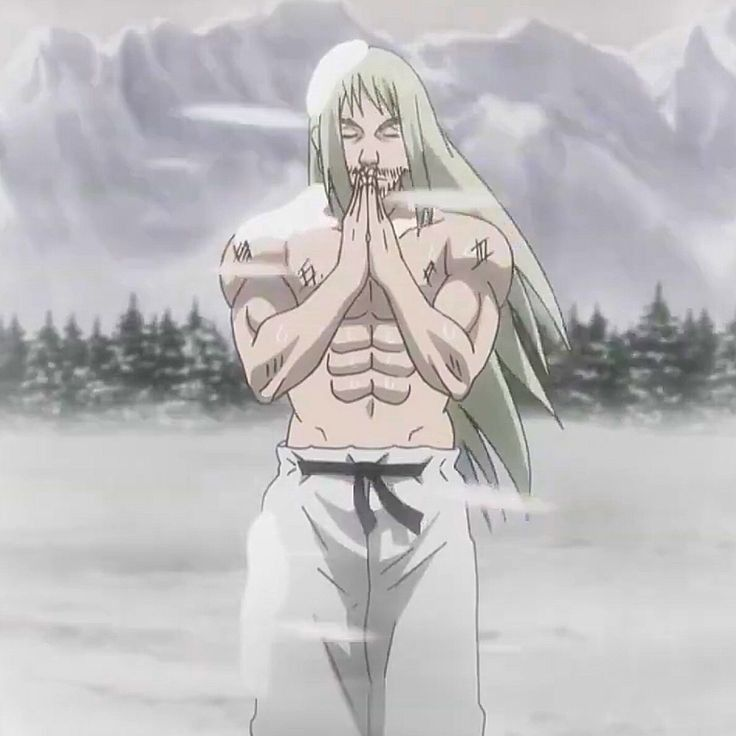
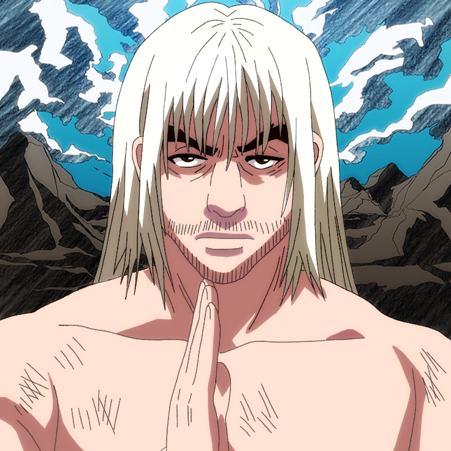
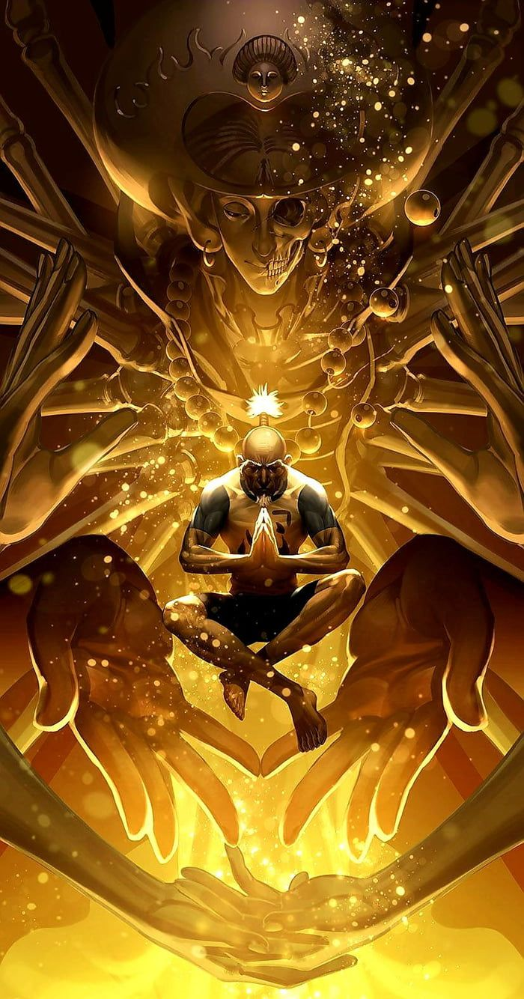

# azaza

Projet conçu en équipe avec : Omar Sbai Idrissi et Miguel Lopes

## Le concept et l'audience

- Une phrase (logline) : ... Netero qui est à la recherce de l'adversaire le plus fort qu'il peut trouver pour pouvoir donner tout ce qu'il a, il s'entraine donc et rencontre plusieurs obstacles avant d'en arriver là. 
- Le public cible : Les fans de combats, d'anime et specialement ceux de HunterXHunter
- La franchise d'origine : ... Manga Hunter X Hunter par Yoshihiro Togashi

## L'intrigue

- Le début : ...Quand Netero était petit, il a vu deux combattants qui se sont battus à pleine force, malgrès la douleur et les efforts, ces combattants semblaient s'amuser au maximum et démontraient un art de combat que seulement les plus disciplinés pouvaient atteindre. Il fut Inspiré au maximum et rêvait d'une personne qui pourrait le pousser à son maximum. Il jure alors de s'entrainer à la dure pendant le restant de sa vie.
- Le milieu : Après plusieurs années, Netero remporta plusieurs compétitions dans divers arts martiaux incluant la boxe, le judo, le taekwondo et autres. Il a appris à courir aussi vite qu'un joueur olympique, frapper aussi fort qu'un boxeur, sauter aussi haut qu'un leopard. ect.. Il atteingna les sommets, la gloire
et l'argent
- Le revirement (plot twist) : ... Malheuresement, Netero n'arrivait pas à trouver d'adversaire à sa taille. Jusqu'à qu'il finit par entrer dans une compétition d'art martiaux pour jeune talentieux prometteur caché en tant que spectateur. Un jeune garçon du nom de Yujiro finit par lui tapper dans l'oeil, Netero eu l'idée alors de l'entrainer pour qu'il puisse créer son propre rivale
- La fin : Après plusieurs années, le garçon finit aussi par gagner plusieurs compétitions et atteindre un niveau très élevée au niveau de la bagarre. Sentant que l'enfant est enfin prêt à battre le maitre, Netero finit par lui faire passer le test ultime, celui de gagner contre lui. Après toute une journée de combat, le jeune garçon Yujiro finit par gagner et Netero finit par enfin être satisfait du rêve qu'il eu quand il était jeune.

## Le personnage principal

- Description (physique et psychologique) : ... Combattant d'art martiaux, très fort mentalement et physiquement
- Son désir (ce qu'il veut) : ... Trouver l'adversaire qui le satisfera au combat
- Son besoin (ce qu'il lui faut) : ... 1. Devenir très fort pour être la hauteur du combat 2. Trouver son adversaire
- Son évolution : ... 1. Enfant Qui S'entraine tous les jours 2. Adolescents/Jeunes Adultes qui gagnent les compétitions. 3. Entraine son futur adversaire

## L'univers

- Où et quand se passe l'histoire : ... Dans le monde d'Hunter X Hunter en 2001
- Un élément de folklore qui rend l'univers vivant : ... Les différentes abilités uniques que les combattants peuvent maitriser tels que le Nen qui englobe le Zen, Le Zetsu, le Hatsu et le Ten

## La direction cinématographique

- La palette de couleurs : ... Blanc, Gris, Noir, Rouge, Jaune, Bleu
- L'éclairage : ... Lumière un peu partout??
- Le rythme du montage : ... Assez rapide
- Un moodboard (3 à 5 images de référence) :

